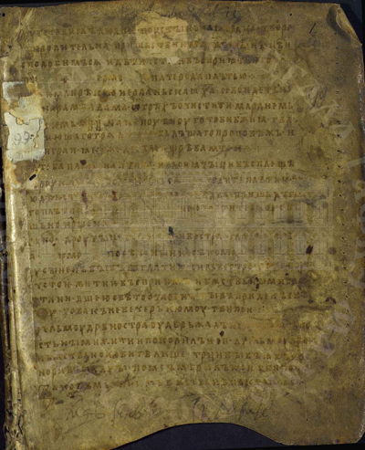
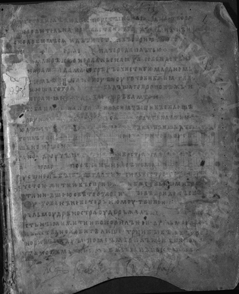
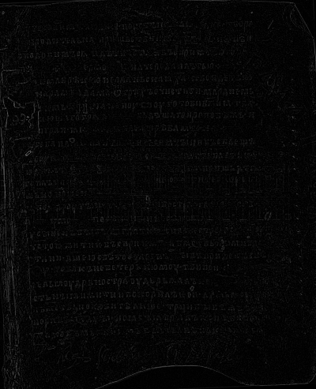
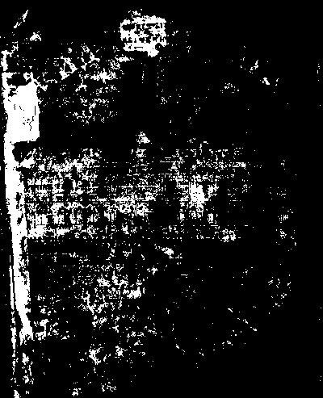
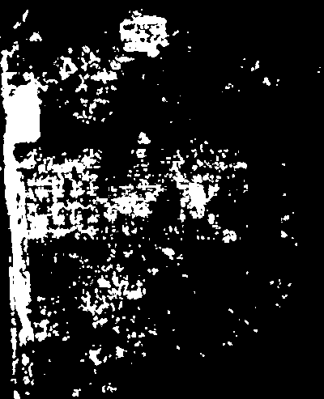
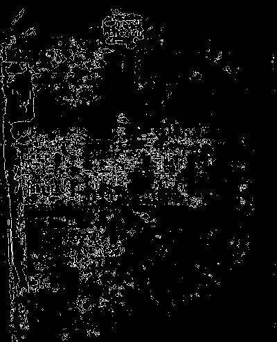

# Лабораторная работа №3
## Фильтрация изображений и морфологические операции

### Вариант 8: Ранговый фильтр, маска равнина, окно 3x3
### Ранг: 7/9

### Исходные данные
- Количество изображений: 3
- Использованы полноцветные изображения, переведенные в полутон и монохром.
- Монохром создается порогом 128.
- Разностные изображения:
  - полутон: модуль разности `|I - F|` (дополнительно показана версия с усилением контраста);
  - монохром: `XOR(I, F)`.

### Формулы

Перевод в полутон:

```text
I(x, y) = 0.299 * R(x, y) + 0.587 * G(x, y) + 0.114 * B(x, y)
```

Ранговый фильтр (окно 3x3, ранг 7/9):

```text
F(x, y) = rank_7( W(x, y) )
```

Разностные изображения:

```text
D_gray(x, y) = |I(x, y) - F(x, y)|
D_mono(x, y) = I_mono(x, y) XOR F_mono(x, y)
```

### 1. Полутоновая обработка

#### 1.1 Изображение 1
Источник: `img0.png`

| Исходное RGB | Полутоновое | После фильтра | Разностное `|I-F|` | Разностное (x4) |
|:------------:|:-----------:|:-------------:|:------------------:|:---------------:|
|  |  |  |  |  |

#### 1.2 Изображение 2
Источник: `img1.png`

| Исходное RGB | Полутоновое | После фильтра | Разностное `|I-F|` | Разностное (x4) |
|:------------:|:-----------:|:-------------:|:------------------:|:---------------:|
|  |  |  |  |  |

#### 1.3 Изображение 3
Источник: `img2.png`

| Исходное RGB | Полутоновое | После фильтра | Разностное `|I-F|` | Разностное (x4) |
|:------------:|:-----------:|:-------------:|:------------------:|:---------------:|
|  |  |  |  |  |

### 2. Монохромная обработка

#### 2.1 Изображение 1

| Исходное монохромное | После фильтра | XOR-разность |
|:--------------------:|:-------------:|:------------:|
|  |  |  |

#### 2.2 Изображение 2

| Исходное монохромное | После фильтра | XOR-разность |
|:--------------------:|:-------------:|:------------:|
|  |  |  |

#### 2.3 Изображение 3

| Исходное монохромное | После фильтра | XOR-разность |
|:--------------------:|:-------------:|:------------:|
|  |  |  |

### Результаты выполнения

| Изображение | Размер | Фильтр |
|:------------|-------:|:-------|
| №1 (img0.png) | 400x493 | Ранговый фильтр, ранг 7/9, окно 3x3 |
| №2 (img1.png) | 1715x2671 | Ранговый фильтр, ранг 7/9, окно 3x3 |
| №3 (img2.png) | 1794x2580 | Ранговый фильтр, ранг 7/9, окно 3x3 |

### Выводы

1. Реализован ранговый фильтр (вариант 8) без библиотечных функций фильтрации.
2. Получены отфильтрованные изображения в полутоне и монохроме.
3. Сформированы разностные изображения: модуль разности для полутона и XOR для монохрома.
