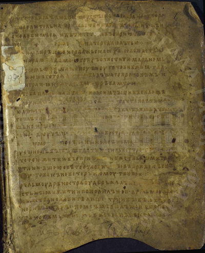
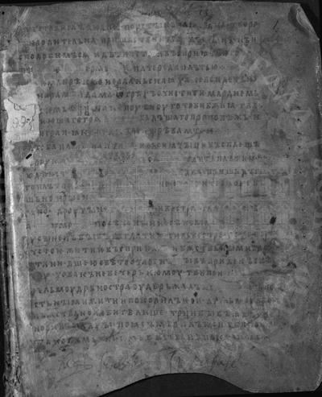
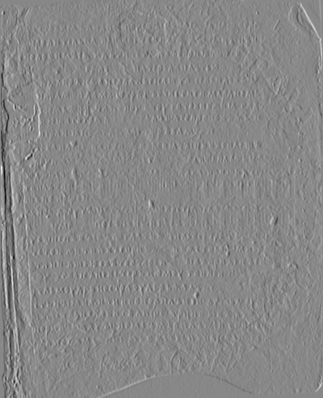
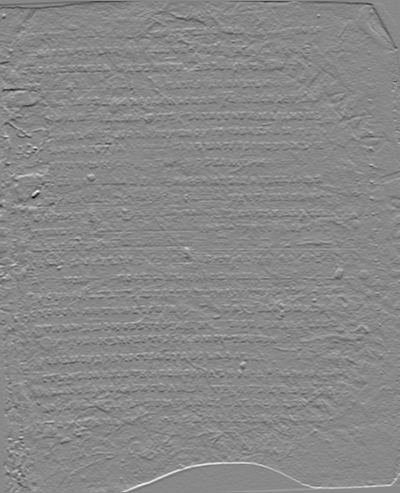
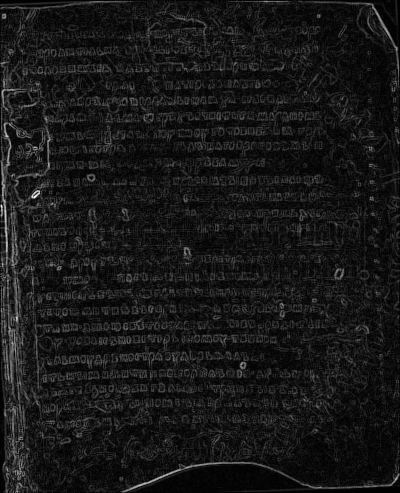
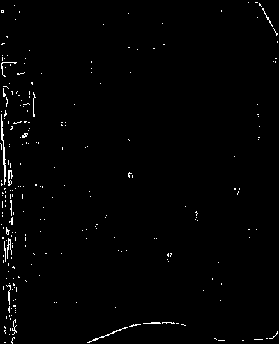

# Лабораторная работа №4
## Выделение контуров на изображении

### Вариант 8
- Оператор: Прюитт 3x3
- Формула градиента: `G = |Gx| + |Gy|`
- Порог бинаризации градиентной матрицы: `T=90` (подобран опытным путем)

### Исходные данные
- Файл: `src/img0.png`
- Размер изображения: `400x493`

### Формулы

Перевод цветного изображения в полутоновое:

```text
I(x, y) = 0.299 * R(x, y) + 0.587 * G(x, y) + 0.114 * B(x, y)
```

Градиенты по оператору Прюитта (ядра 3x3):

```text
Gx = [[ 1,  0, -1],
      [ 1,  0, -1],
      [ 1,  0, -1]]

Gy = [[ 1,  1,  1],
      [ 0,  0,  0],
      [-1, -1, -1]]
```

```text
Gx = I * Gx
Gy = I * Gy
G  = |Gx| + |Gy|
```

Бинаризация градиентной матрицы:

```text
B(x, y) = 255, если G(x, y) >= T, иначе 0
```

### Результаты

#### 1. Исходное цветное изображение


#### 2. Полутоновое изображение


#### 3. Градиентные матрицы (нормализованные 0..255)
| Gx | Gy | G |
|:--:|:--:|:--:|
|  |  |  |

#### 4. Бинаризованная градиентная матрица G


### Таблица файлов
| Операция | Файл |
|:---------|:-----|
| Исходное цветное | `results/source_color.png` |
| Полутоновое | `results/grayscale.bmp` |
| Нормализованная матрица Gx | `results/gx_norm.bmp` |
| Нормализованная матрица Gy | `results/gy_norm.bmp` |
| Нормализованная матрица G | `results/g_norm.bmp` |
| Бинаризация G | `results/g_binary.bmp` |

### Вывод
Для варианта 8 реализовано выделение контуров оператором Прюитта 3x3 с формулой `G = |Gx| + |Gy|`. Получены матрицы `Gx`, `Gy`, `G` и итоговая бинаризованная карта контуров.
