# Лабораторная работа №5
## Выделение признаков символов

### Вариант 8: алфавит Османья

### Параметры генерации
- Шрифт: `/System/Library/Fonts/Supplemental/NotoSansOsmanya-Regular.ttf`
- Размер шрифта: `96`
- Количество символов: `30`
- Принцип: `1 символ = 1 файл`, белые поля обрезаны.

### Формулы признаков

```text
I_b(x, y) = 1 для черного пикселя и 0 для белого
M_q = sum I_b(x, y), где (x, y) принадлежит четверти q
w_q = M_q / S_q
M = sum I_b(x, y)
xc = (1/M) * sum x * I_b(x, y)
yc = (1/M) * sum y * I_b(x, y)
xc_norm = xc / (W - 1)
yc_norm = yc / (H - 1)
Ix = sum (y - yc)^2 * I_b(x, y)
Iy = sum (x - xc)^2 * I_b(x, y)
Ix_norm = Ix / (M * H^2)
Iy_norm = Iy / (M * W^2)
profile_X(x) = sum_y I_b(x, y)
profile_Y(y) = sum_x I_b(x, y)
```

### Результаты генерации символов и профилей

| № | Символ | Unicode | Название | Эталон | Профиль X | Профиль Y |
|:--:|:------:|:-------:|:---------|:------:|:---------:|:---------:|
| 1 | 𐒀 | `U+10480` | OSMANYA LETTER ALEF | 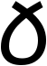 | 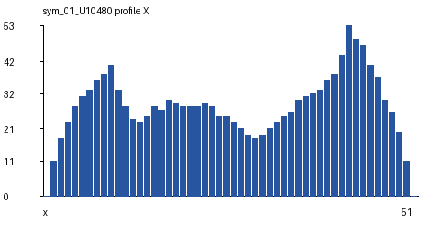 | 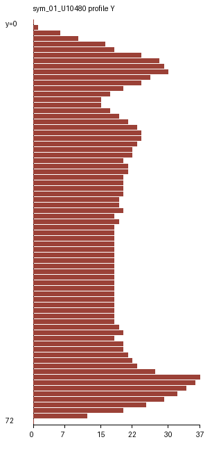 |
| 2 | 𐒁 | `U+10481` | OSMANYA LETTER BA |  | 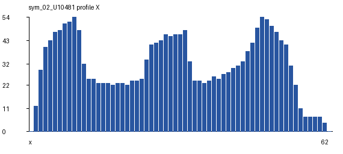 | 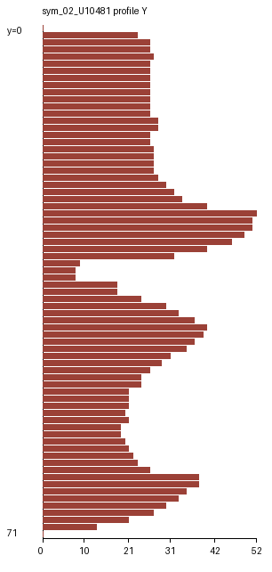 |
| 3 | 𐒂 | `U+10482` | OSMANYA LETTER TA | 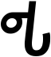 | 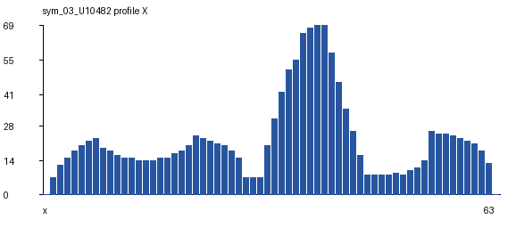 | 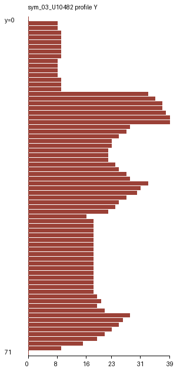 |
| 4 | 𐒃 | `U+10483` | OSMANYA LETTER JA |  | 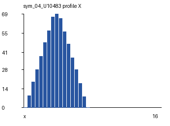 | 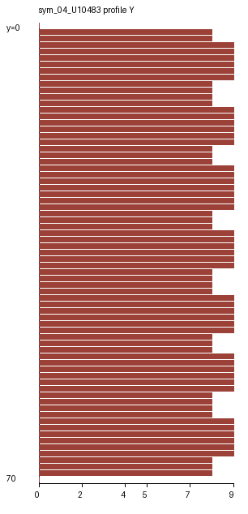 |
| 5 | 𐒄 | `U+10484` | OSMANYA LETTER XA | 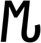 | 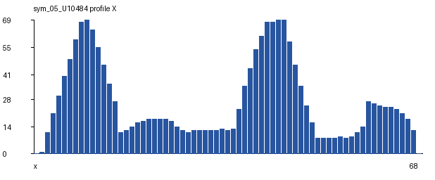 | 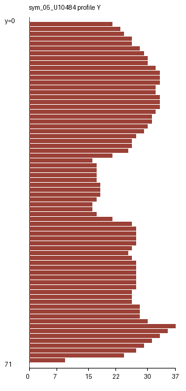 |
| 6 | 𐒅 | `U+10485` | OSMANYA LETTER KHA | 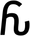 | 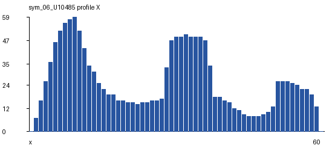 | 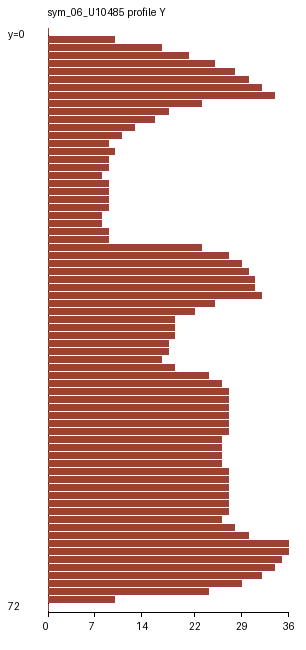 |
| 7 | 𐒆 | `U+10486` | OSMANYA LETTER DEEL | 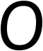 | 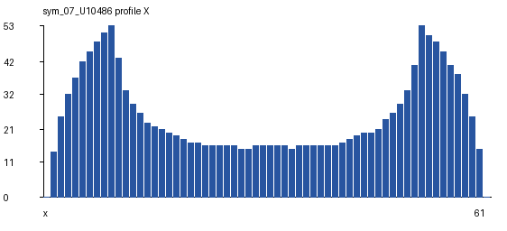 | 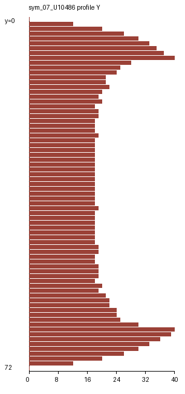 |
| 8 | 𐒇 | `U+10487` | OSMANYA LETTER RA | 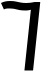 | 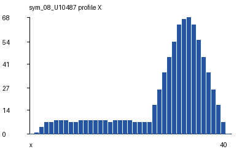 | 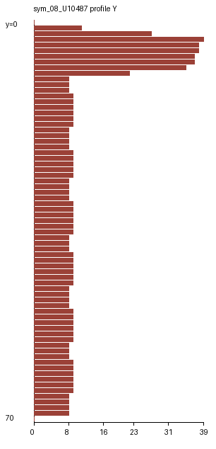 |
| 9 | 𐒈 | `U+10488` | OSMANYA LETTER SA | 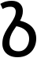 | 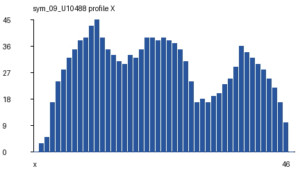 | 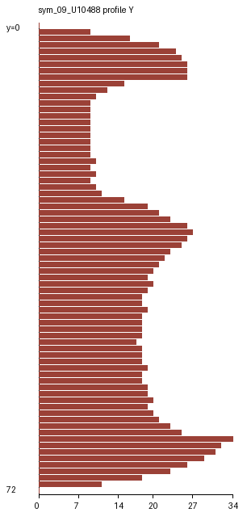 |
| 10 | 𐒉 | `U+10489` | OSMANYA LETTER SHIIN | 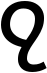 | 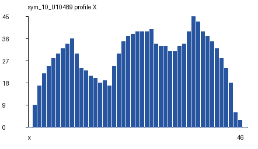 | 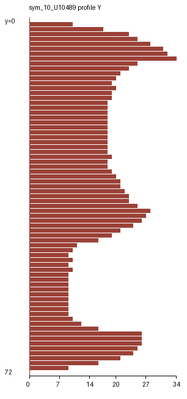 |
| 11 | 𐒊 | `U+1048A` | OSMANYA LETTER DHA | 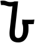 | 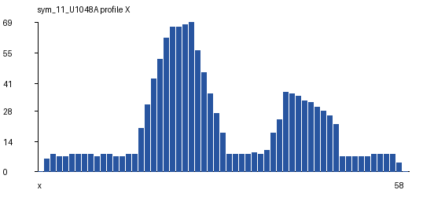 | 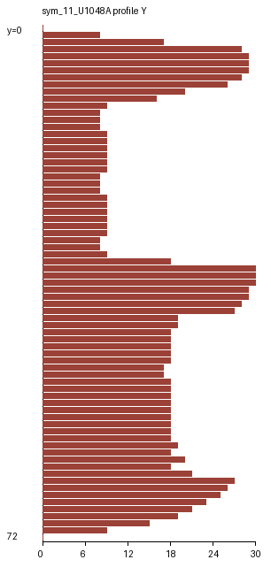 |
| 12 | 𐒋 | `U+1048B` | OSMANYA LETTER CAYN | 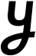 | 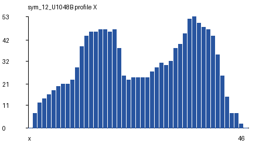 | 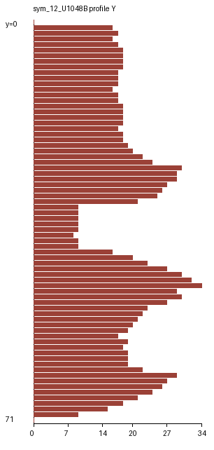 |
| 13 | 𐒌 | `U+1048C` | OSMANYA LETTER GA | 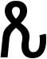 | 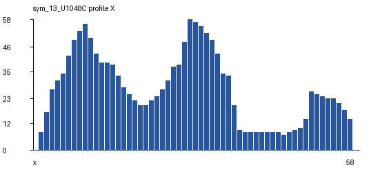 | 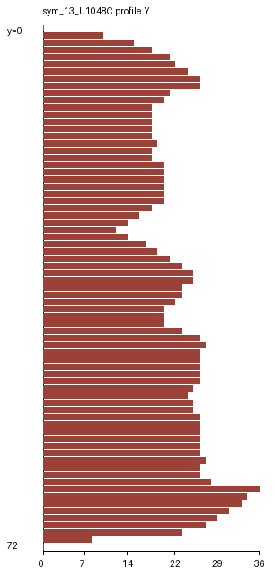 |
| 14 | 𐒍 | `U+1048D` | OSMANYA LETTER FA | 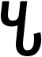 | 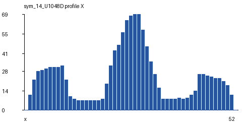 | 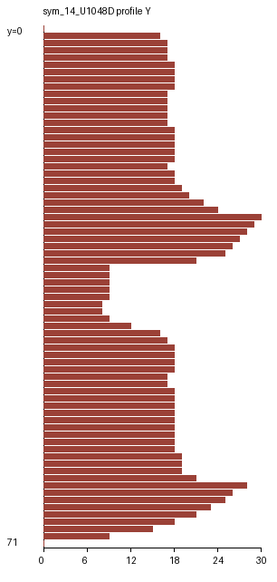 |
| 15 | 𐒎 | `U+1048E` | OSMANYA LETTER QAAF | 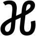 | 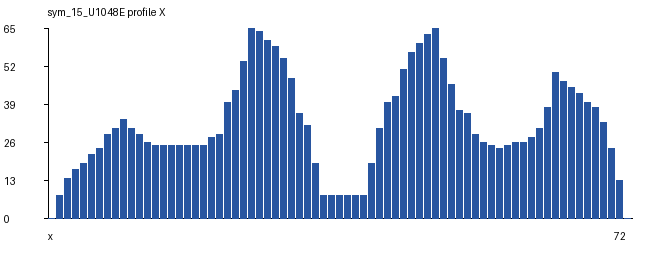 | 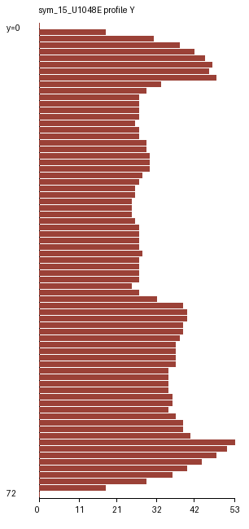 |
| 16 | 𐒏 | `U+1048F` | OSMANYA LETTER KAAF |  | 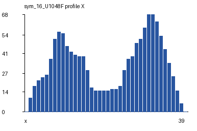 | 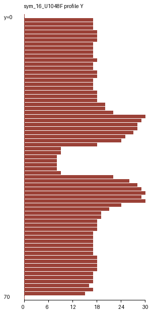 |
| 17 | 𐒐 | `U+10490` | OSMANYA LETTER LAAN | 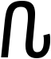 | 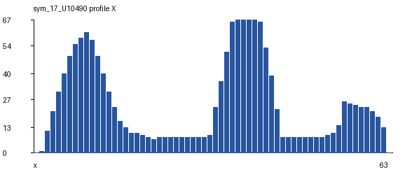 | 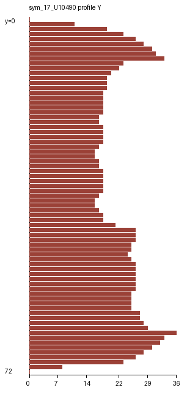 |
| 18 | 𐒑 | `U+10491` | OSMANYA LETTER MIIN |  | 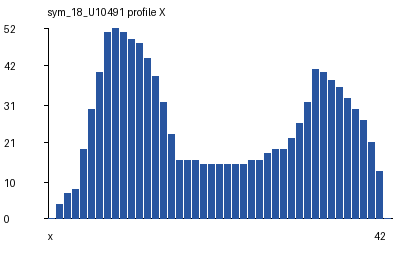 | 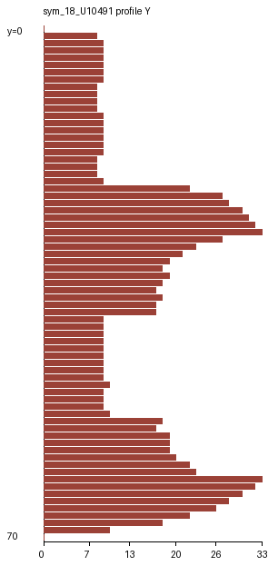 |
| 19 | 𐒒 | `U+10492` | OSMANYA LETTER NUUN |  |  |  |
| 20 | 𐒓 | `U+10493` | OSMANYA LETTER WAW |  |  |  |
| 21 | 𐒔 | `U+10494` | OSMANYA LETTER HA |  |  |  |
| 22 | 𐒕 | `U+10495` | OSMANYA LETTER YA |  |  |  |
| 23 | 𐒖 | `U+10496` | OSMANYA LETTER A |  |  |  |
| 24 | 𐒗 | `U+10497` | OSMANYA LETTER E |  |  |  |
| 25 | 𐒘 | `U+10498` | OSMANYA LETTER I |  |  |  |
| 26 | 𐒙 | `U+10499` | OSMANYA LETTER O |  |  |  |
| 27 | 𐒚 | `U+1049A` | OSMANYA LETTER U |  |  |  |
| 28 | 𐒛 | `U+1049B` | OSMANYA LETTER AA |  |  |  |
| 29 | 𐒜 | `U+1049C` | OSMANYA LETTER EE |  |  |  |
| 30 | 𐒝 | `U+1049D` | OSMANYA LETTER OO |  |  |  |

### Табличные признаки

- Скалярные признаки сохранены в CSV (`;`-разделитель): `results/features.csv`.
- Профили сохранены в PNG с целочисленными подписями осей.

### Вывод
Для алфавита Османья по варианту 8 сгенерированы эталонные изображения букв, рассчитаны массы четвертей, удельные веса, координаты центра тяжести, нормированные координаты, осевые моменты инерции, нормированные моменты и профили X/Y.
