# Лабораторная работа №6
## Сегментация текста

### Вариант 8: алфавит Османья

### Исходные данные
- Фраза: `𐒓𐒛𐒒 𐒏𐒚 𐒃𐒗𐒋𐒐𐒖𐒔𐒖𐒕`
- Транслитерация: `waan ku jeclahay`
- Шрифт: `/System/Library/Fonts/Supplemental/NotoSansOsmanya-Regular.ttf`, размер `92`
- Межбуквенный интервал при подготовке строки: `8` px
- Размер монохромного изображения: `805x68`
- Количество найденных символов: `13`

### Формулы профилей

```text
H(y) = sum_x I_b(x, y)
V(x) = sum_y I_b(x, y)
```

Где `I_b(x,y)=1` для черного пикселя и `0` для белого.

### 1. Подготовка строки

#### 1.1 Монохромное изображение фразы
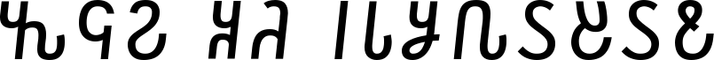

### 2. Профили изображения

| Горизонтальный профиль | Вертикальный профиль |
|:----------------------:|:--------------------:|
| 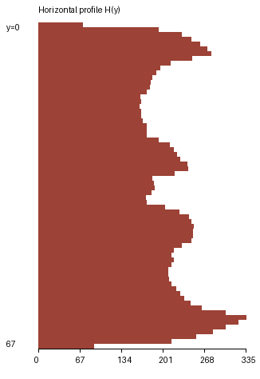 | 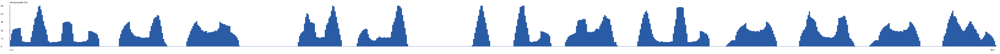 |

### 3. Сегментация символов по вертикальному профилю с прореживанием

#### 3.1 Обрамляющие прямоугольники


#### 3.2 Вырезанные сегменты

- Сегмент 1: `[segment_01]` -> 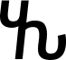
- Сегмент 2: `[segment_02]` -> 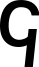
- Сегмент 3: `[segment_03]` -> 
- Сегмент 4: `[segment_04]` -> 
- Сегмент 5: `[segment_05]` -> 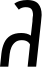
- Сегмент 6: `[segment_06]` -> 
- Сегмент 7: `[segment_07]` -> 
- Сегмент 8: `[segment_08]` -> 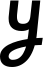
- Сегмент 9: `[segment_09]` -> 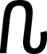
- Сегмент 10: `[segment_10]` -> 
- Сегмент 11: `[segment_11]` -> 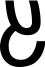
- Сегмент 12: `[segment_12]` -> 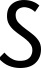
- Сегмент 13: `[segment_13]` -> 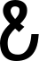

#### 3.3 Массив координат прямоугольников

| idx | x0 | y0 | x1 | y1 | w | h |
|---:|---:|---:|---:|---:|---:|---:|
| 1 | 0 | 1 | 72 | 67 | 73 | 67 |
| 2 | 89 | 0 | 127 | 66 | 39 | 67 |
| 3 | 144 | 0 | 186 | 67 | 43 | 68 |
| 4 | 235 | 1 | 270 | 66 | 36 | 66 |
| 5 | 283 | 0 | 324 | 66 | 42 | 67 |
| 6 | 377 | 1 | 391 | 66 | 15 | 66 |
| 7 | 411 | 1 | 441 | 67 | 31 | 67 |
| 8 | 453 | 1 | 495 | 67 | 43 | 67 |
| 9 | 512 | 0 | 570 | 67 | 59 | 68 |
| 10 | 585 | 0 | 625 | 67 | 41 | 68 |
| 11 | 644 | 1 | 688 | 67 | 45 | 67 |
| 12 | 702 | 0 | 742 | 67 | 41 | 68 |
| 13 | 761 | 0 | 804 | 67 | 44 | 68 |

CSV с координатами (`;`-разделитель): `results/segments_boxes.csv`.

### 4. Профили символов выбранного алфавита

- Эталоны символов: `src/alphabet/templates/`.
- Профили X/Y: `src/alphabet/profiles/`.
- Построены для всех 30 букв алфавита Османья варианта 8.

Пример (первые 6 символов):

| Символ | Unicode | Эталон | Профиль X | Профиль Y |
|:------:|:-------:|:------:|:---------:|:---------:|
| 𐒀 | `U+10480` | 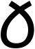 | 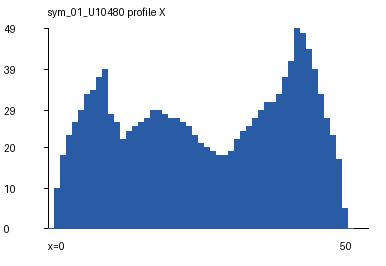 | 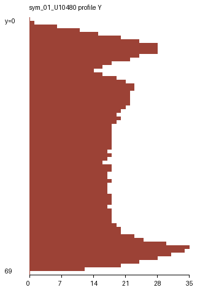 |
| 𐒁 | `U+10481` |  | 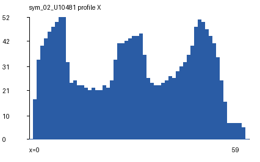 | 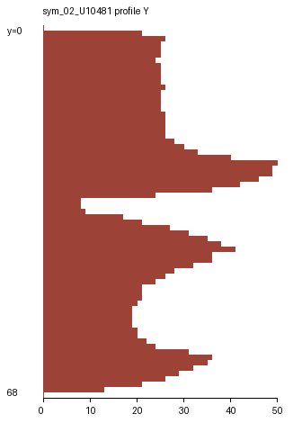 |
| 𐒂 | `U+10482` | 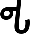 | 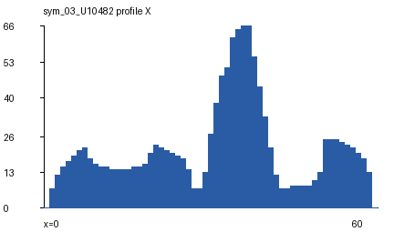 | 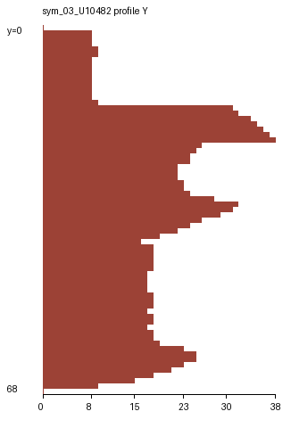 |
| 𐒃 | `U+10483` |  | 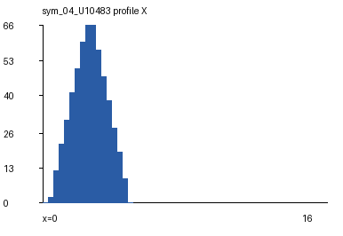 | 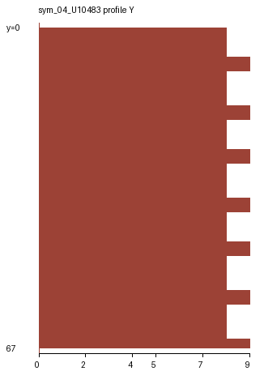 |
| 𐒄 | `U+10484` | 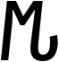 | 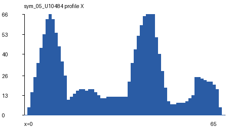 | 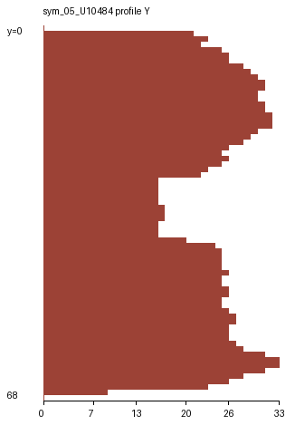 |
| 𐒅 | `U+10485` | 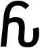 | 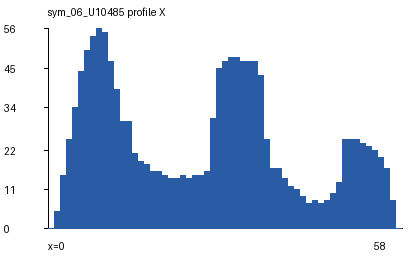 | 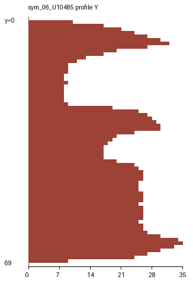 |

### Вывод
Реализованы расчет горизонтального и вертикального профилей, сегментация символов строки на основе вертикального профиля с прореживанием, сохранение массива координат прямоугольников и построение профилей всех букв алфавита Османья.
