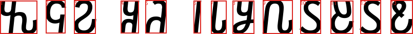
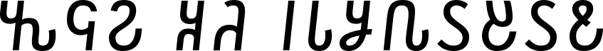
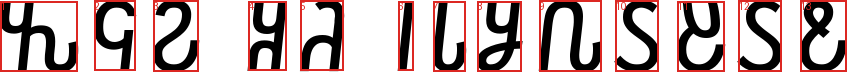

# Лабораторная работа №7
## Классификация на основе признаков, анализ профилей

### Вариант 8: алфавит Османья

### Исходные данные
- Шрифт: `/System/Library/Fonts/Supplemental/NotoSansOsmanya-Regular.ttf`
- Базовый размер: `92`
- Экспериментальный размер: `98`
- Фраза: `𐒓𐒛𐒒 𐒏𐒚 𐒃𐒗𐒋𐒐𐒖𐒔𐒖𐒕`
- Транслитерация: `waan ku jeclahay`
- Алфавит: `30` символов

### Формулы

Евклидово расстояние в пространстве нормализованных признаков:

```text
d(a, b) = sqrt(sum_i (a_i - b_i)^2)
```

Мера близости:

```text
S(a, b) = 1 / (1 + d(a, b))
```

Процент правильного распознавания:

```text
P = (1 - E / N) * 100%
```

Использованные признаки: нормированная масса, нормированные координаты центра тяжести, нормированные осевые моменты инерции.

### 1. Эталонные символы и признаки

- Эталоны: `src/templates/`
- Таблица признаков: `src/template_features.csv` (`;`-разделитель)

### 2. Классификация базовой строки

| Монохромная строка | Сегментация (прямоугольники) |
|:------------------:|:----------------------------:|
|  |  |

- Гипотезы: `src/classification/base_hypotheses.txt`
- Координаты сегментов: `src/classification/base_boxes.csv`
- Эталонная последовательность (без пробелов): `𐒓𐒛𐒒𐒏𐒚𐒃𐒗𐒋𐒐𐒖𐒔𐒖𐒕`
- Распознанная последовательность: `𐒓𐒛𐒒𐒏𐒚𐒃𐒗𐒋𐒐𐒖𐒔𐒖𐒕`
- Ошибок: `0`
- Точность: `100.00%`

### 3. Эксперимент с другим размером шрифта

| Монохромная строка | Сегментация (прямоугольники) |
|:------------------:|:----------------------------:|
|  |  |

- Гипотезы: `src/classification/experiment_hypotheses.txt`
- Координаты сегментов: `src/classification/experiment_boxes.csv`
- Эталонная последовательность (без пробелов): `𐒓𐒛𐒒𐒏𐒚𐒃𐒗𐒋𐒐𐒖𐒔𐒖𐒕`
- Распознанная последовательность: `𐒓𐒛𐒒𐒏𐒚𐒃𐒗𐒋𐒐𐒖𐒔𐒖𐒕`
- Ошибок: `0`
- Точность: `100.00%`

### 4. Сравнение результатов

| Режим | Размер шрифта | Сегментов | Ошибок | Точность (%) |
|:------|--------------:|----------:|-------:|-------------:|
| Базовый | 92 | 13 | 0 | 100.00 |
| Эксперимент | 98 | 13 | 0 | 100.00 |

Сводная таблица сохранена в `results/classification_summary.csv`.

### Вывод
Реализована классификация символов по евклидовой мере близости нормализованных признаков. Для каждого сегмента получены ранжированные гипотезы, построена распознанная строка, рассчитаны ошибки и процент верного распознавания. Проведен эксперимент с изменением размера шрифта.
