# Лабораторная работа №8
## Текстурный анализ и контрастирование

### Вариант 8: GLRLM
- Матрица: GLRLM, матрица длин серий.
- Признаки: `GLNU`, `RLNU`.
- Преобразование яркости: линейное преобразование яркости.
- Количество уровней квантования яркости для GLRLM: `16`.
- Направления серий: `0`, `45`, `90`, `135` градусов.

### Формулы

Линейное преобразование яркости в канале `L` модели HSL:

```text
L'(x, y) = a * L(x, y) + b
a = 1 / (Lmax - Lmin)
b = -Lmin / (Lmax - Lmin)
```

Матрица длин серий GLRLM:

```text
n(a, r) = количество серий длины r с уровнем яркости a
K = sum_a sum_r n(a, r)
N_a = sum_r n(a, r)
N_r = sum_a n(a, r)
GLNU = (1 / K) * sum_a N_a^2
RLNU = (1 / K) * sum_r N_r^2
```

### Исходные данные

| Случай | Источник | Размер |
|:------:|:---------|:------:|
| case1 | `../лаба 4/src/img0.png` | `400x493` |
| case2 | `../лаба 3/src/img1.png` | `1715x2671` |
| case3 | `../лаба2/src/img2.png` | `1794x2580` |

### Результаты по изображениям

#### case1
- Источник: `../лаба 4/src/img0.png`
- Параметры линейного преобразования: `Lmin=0.000000`, `Lmax=0.962745`, `a=1.038697`, `b=-0.000000`

| Исходное RGB | Полутоновое L до | Полутоновое L после |
|:------------:|:----------------:|:-------------------:|
| 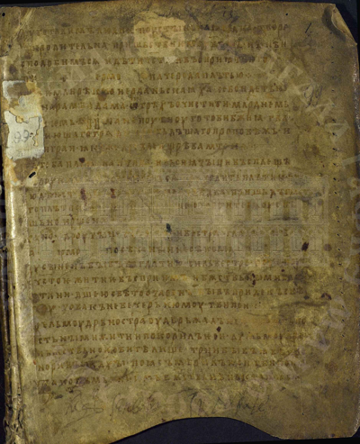 | 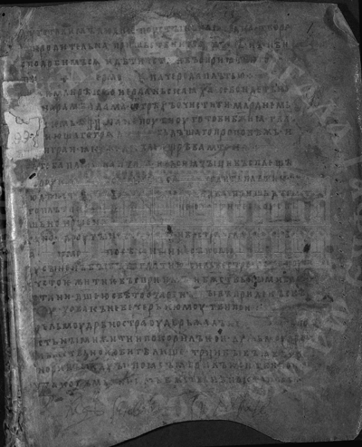 | 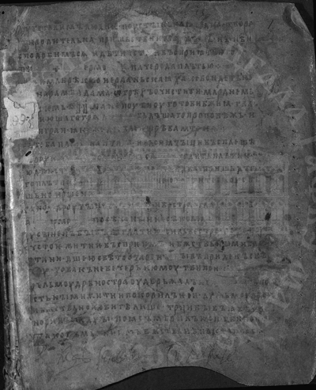 |

| Контрастированное RGB | Гистограммы яркости до/после |
|:---------------------:|:----------------------------:|
| 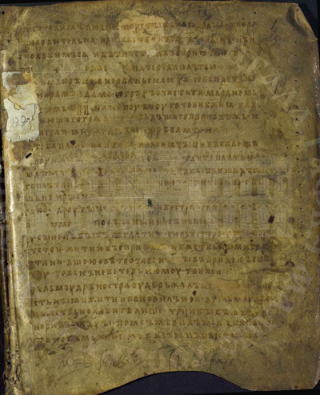 | 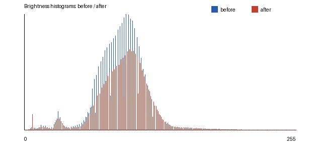 |

| GLRLM до | GLRLM после |
|:--------:|:-----------:|
| 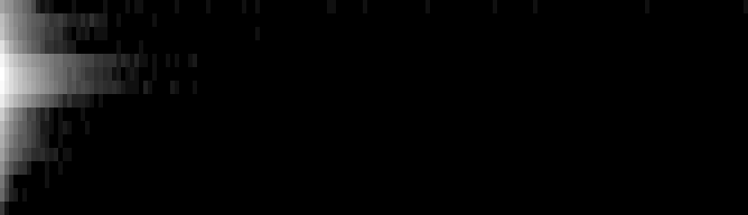 | 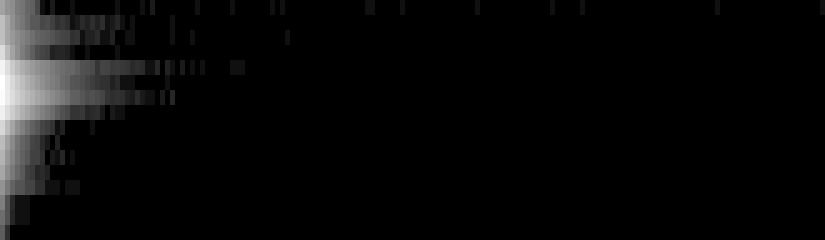 |

| Метрика | До | После |
|:--------|---:|------:|
| K, число серий | `355868` | `363654` |
| GLNU | `72409.027167` | `71561.478235` |
| RLNU | `117894.767273` | `123925.308255` |
| GLNU_norm | `0.20347159` | `0.19678452` |
| RLNU_norm | `0.33128791` | `0.34077807` |

CSV: `src/case1/glrlm_before.csv`, `src/case1/glrlm_after.csv`, `src/case1/features_compare.csv`

#### case2
- Источник: `../лаба 3/src/img1.png`
- Параметры линейного преобразования: `Lmin=0.000000`, `Lmax=0.809804`, `a=1.234867`, `b=-0.000000`

| Исходное RGB | Полутоновое L до | Полутоновое L после |
|:------------:|:----------------:|:-------------------:|
| 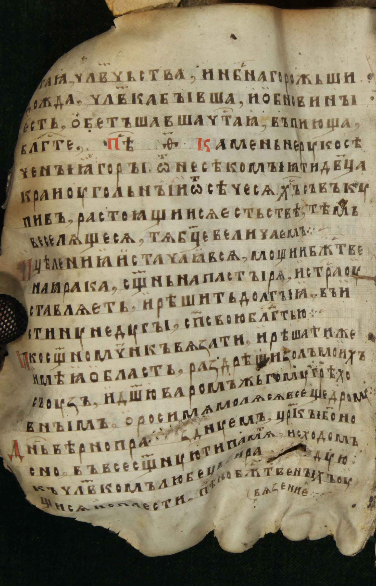 | 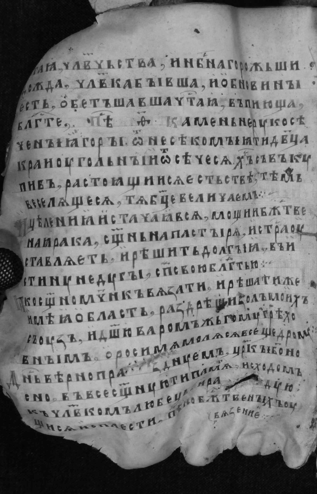 | 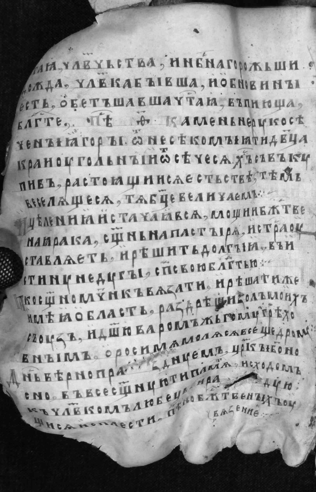 |

| Контрастированное RGB | Гистограммы яркости до/после |
|:---------------------:|:----------------------------:|
| 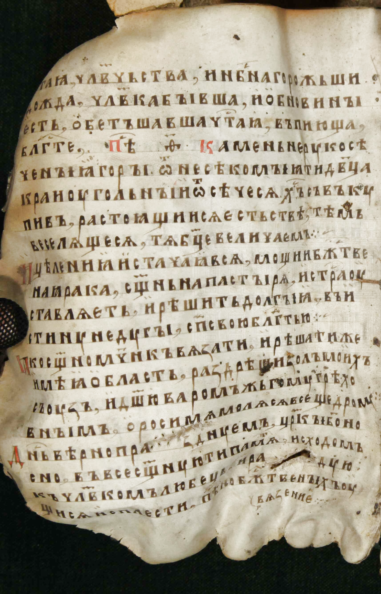 | 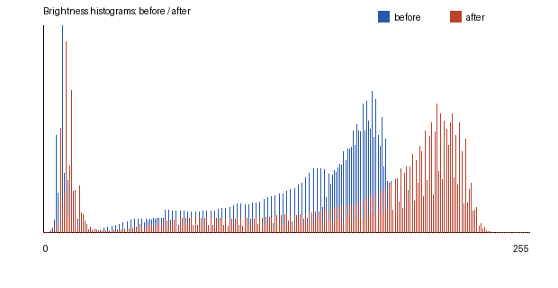 |

| GLRLM до | GLRLM после |
|:--------:|:-----------:|
| 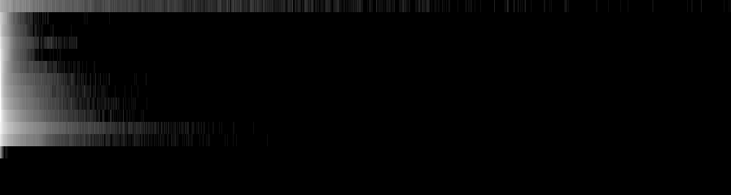 | 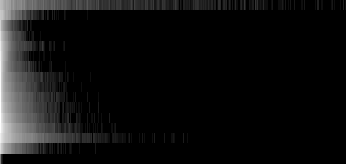 |

| Метрика | До | После |
|:--------|---:|------:|
| K, число серий | `3608693` | `4241262` |
| GLNU | `413515.215579` | `398802.824032` |
| RLNU | `803003.122950` | `1012697.551160` |
| GLNU_norm | `0.11458864` | `0.09402928` |
| RLNU_norm | `0.22251910` | `0.23877269` |

CSV: `src/case2/glrlm_before.csv`, `src/case2/glrlm_after.csv`, `src/case2/features_compare.csv`

#### case3
- Источник: `../лаба2/src/img2.png`
- Параметры линейного преобразования: `Lmin=0.000000`, `Lmax=0.968627`, `a=1.032389`, `b=-0.000000`

| Исходное RGB | Полутоновое L до | Полутоновое L после |
|:------------:|:----------------:|:-------------------:|
| 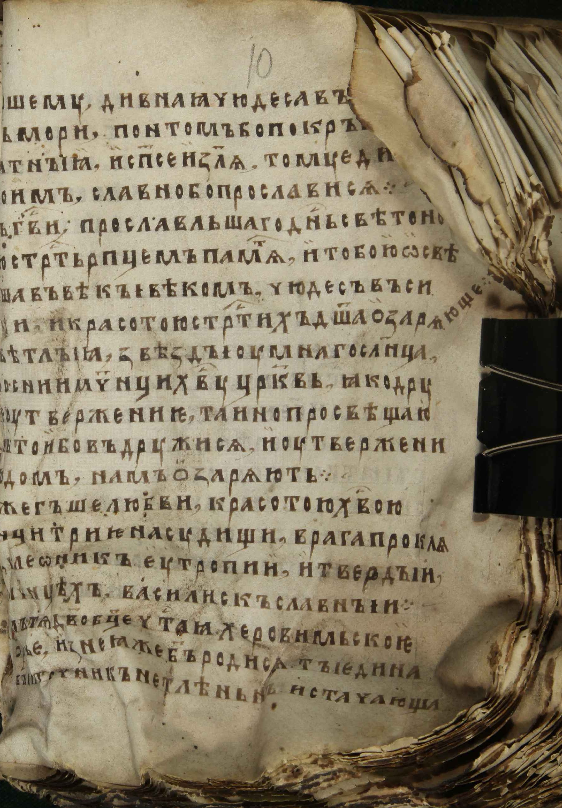 |  | 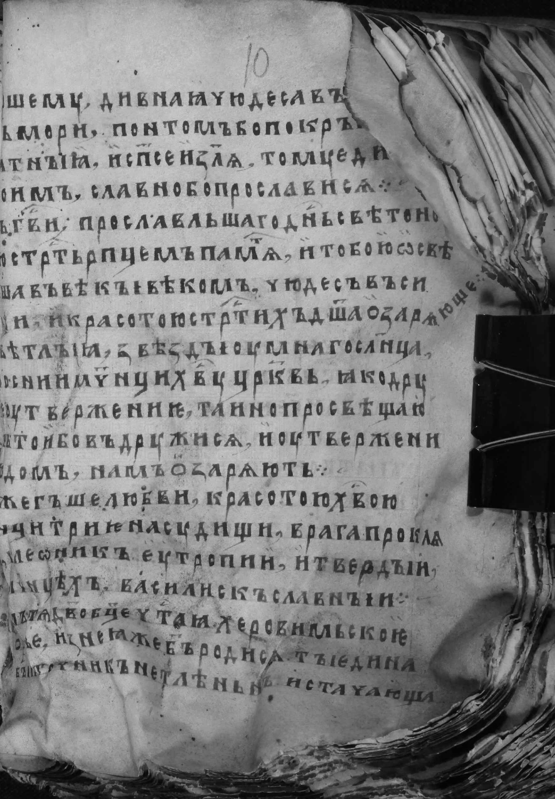 |

| Контрастированное RGB | Гистограммы яркости до/после |
|:---------------------:|:----------------------------:|
| 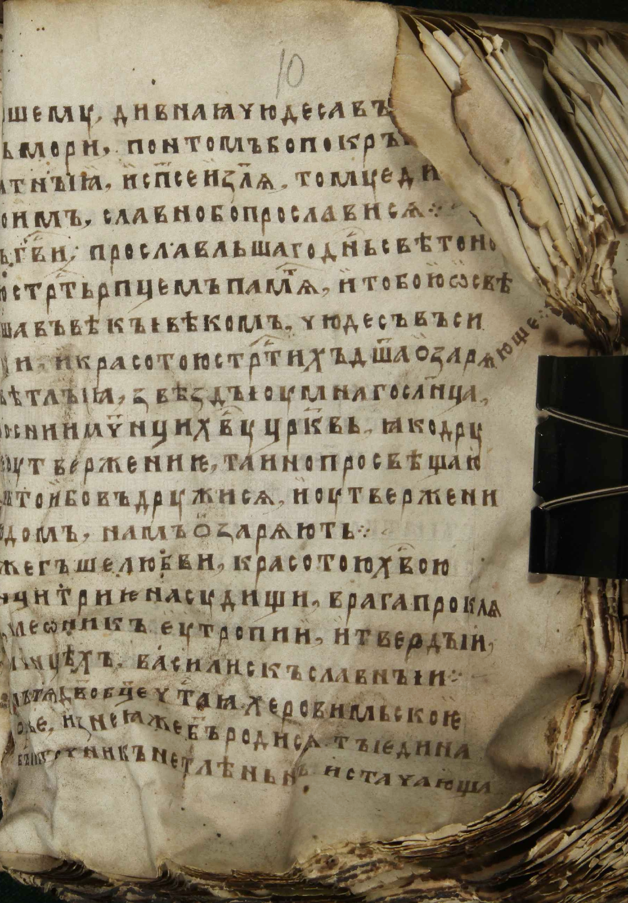 | 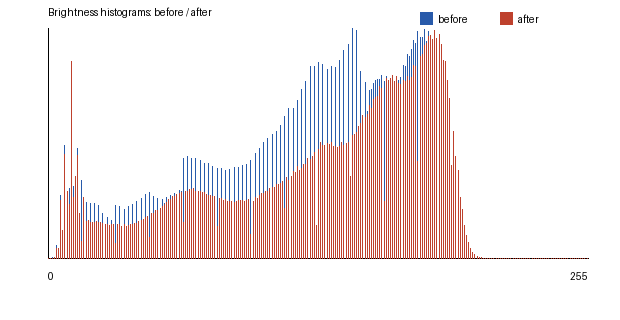 |

| GLRLM до | GLRLM после |
|:--------:|:-----------:|
|  | 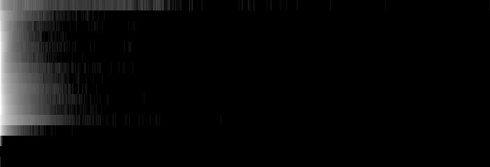 |

| Метрика | До | После |
|:--------|---:|------:|
| K, число серий | `4736793` | `4885586` |
| GLNU | `486506.848349` | `478485.891622` |
| RLNU | `1112862.795684` | `1162984.399311` |
| GLNU_norm | `0.10270807` | `0.09793828` |
| RLNU_norm | `0.23494014` | `0.23804399` |

CSV: `src/case3/glrlm_before.csv`, `src/case3/glrlm_after.csv`, `src/case3/features_compare.csv`

### Сводные результаты

| Случай | Размер | GLRLM до | GLRLM после | GLNU до | GLNU после | RLNU до | RLNU после |
|:------:|:------:|:--------:|:-----------:|--------:|-----------:|--------:|-----------:|
| case1 | `400x493` | `16x167` | `16x165` | 72409.027167 | 71561.478235 | 117894.767273 | 123925.308255 |
| case2 | `1715x2671` | `16x898` | `16x504` | 413515.215579 | 398802.824032 | 803003.122950 | 1012697.551160 |
| case3 | `1794x2580` | `16x702` | `16x702` | 486506.848349 | 478485.891622 | 1112862.795684 | 1162984.399311 |

Дополнительно: `src/summary.csv`, `src/summary.json`.

### Вывод
Для варианта 8 построены матрицы GLRLM для исходных и линейно контрастированных изображений. Рассчитаны признаки неоднородности яркости серий `GLNU` и неоднородности длин серий `RLNU`; сравнение до/после показывает изменение текстурных признаков после преобразования яркости.
