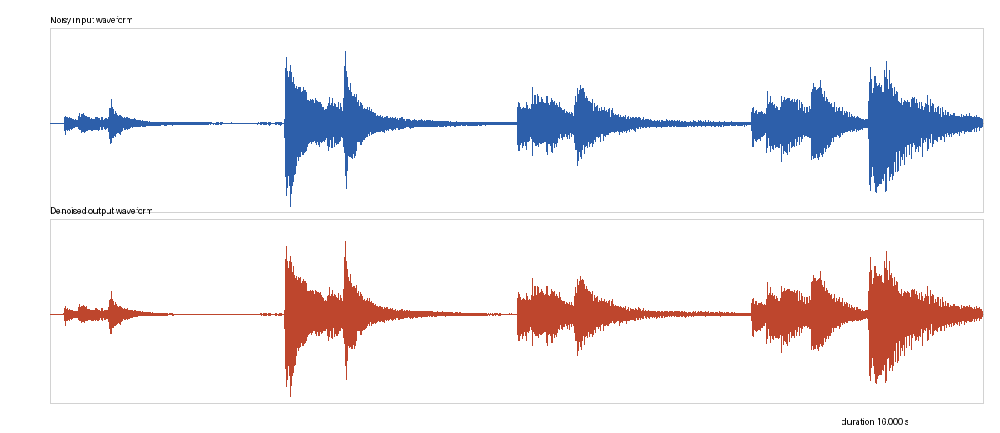
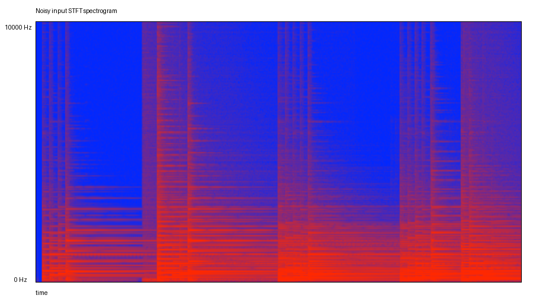
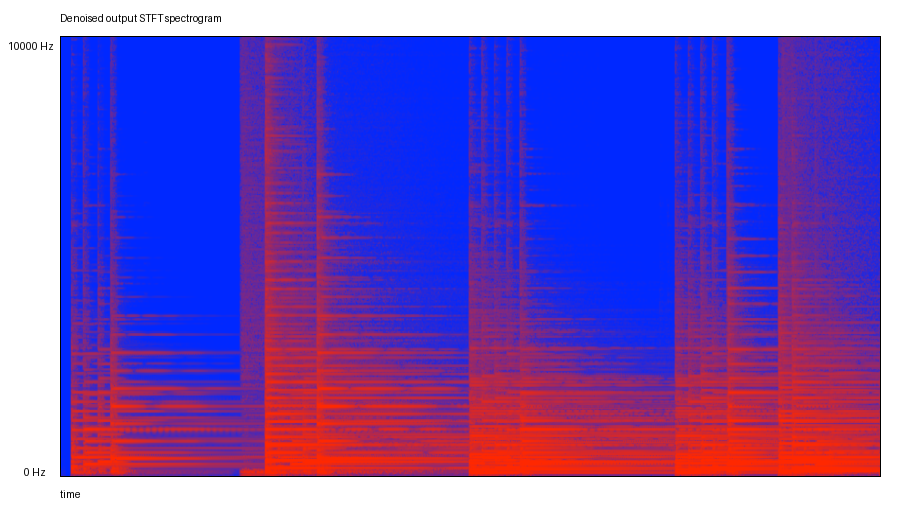

# Лабораторная работа №9
## Анализ шума

### Вариант 8

### Исходные данные
- Формат дорожки: WAV, исходная запись приведена к моно.
- Тип дорожки: запись музыкального инструмента (`фортепиано.wav`).
- Частота дискретизации: `44100` Гц.
- Длительность: `16.000` с.
- Спектрограмма: STFT с окном Ханна.
- Параметры STFT: `nperseg=2048`, `noverlap=1536`.
- Шумоподавление: спектральное вычитание, оценка шума по 10% наименее энергичных STFT-кадров.
- Поиск максимумов энергии: `Δt=0.1 с`, `Δf=50 Гц`.

### Формулы

Кратковременное преобразование Фурье:

```text
X(m, k) = sum_n x[n] * w[n - mR] * exp(-j 2*pi*k*n/N)
```

Спектрограмма мощности:

```text
P(m, k) = |X(m, k)|^2
P_dB(m, k) = 10 * log10(P(m, k))
```

Оценка отношения сигнал/шум:

```text
SNR = 10 * log10(P_signal / P_noise)
```

Спектральное вычитание шума:

```text
|Y(f,t)| = max(|X(f,t)| - alpha * |W(f)|, floor * |X(f,t)|)
phase(Y) = phase(X)
```

### 1. Подготовка сигнала

- Исходная запись: `фортепиано.wav`.
- Моно-дорожка для анализа: `src/noisy_input.wav`.
- Восстановленная дорожка: `src/denoised_output.wav`.
- Временные формы сигналов: `src/waveforms_compare.png`.



### 2. Спектрограммы до и после подавления шума

| До шумоподавления | После шумоподавления |
|:-----------------:|:--------------------:|
|  |  |

### 3. Оценка уровня шума и качества подавления

| Показатель | Значение |
|:----------|---------:|
| Оценка RMS шума до (минимальное окно 0.5 c) | `0.002896` |
| Оценка RMS шума после (минимальное окно 0.5 c) | `0.000284` |
| SNR до шумоподавления | `30.549` dB |
| SNR после шумоподавления | `50.688` dB |
| Прирост SNR | `20.139` dB |

### 4. Моменты времени с наибольшей энергией

Поиск выполнен по окрестности `Δt=0.1 с` и полосам `Δf=50 Гц`.

| № | Время, с | Полоса, Гц | Энергия |
|--:|---------:|-----------:|--------:|
| 1 | 4.100 | 150..200 | 2.60850171e+04 |
| 2 | 4.000 | 150..200 | 2.05022769e+04 |
| 3 | 14.100 | 100..150 | 1.25375186e+04 |
| 4 | 5.000 | 350..400 | 1.11520154e+04 |
| 5 | 4.200 | 150..200 | 1.10120404e+04 |
| 6 | 14.200 | 100..150 | 1.08867335e+04 |
| 7 | 14.100 | 300..350 | 8.40304725e+03 |
| 8 | 14.300 | 100..150 | 7.91844096e+03 |
| 9 | 13.100 | 300..350 | 6.55548885e+03 |
| 10 | 14.200 | 300..350 | 6.50218926e+03 |
| 11 | 14.300 | 150..200 | 6.07310317e+03 |
| 12 | 5.100 | 350..400 | 5.71420584e+03 |

- Полная таблица: `src/high_energy_moments.csv`.

### Вывод
Для варианта 8 выполнен анализ шумовой аудиодорожки: построены спектрограммы STFT с окном Ханна, оценен уровень шума, применено шумоподавление методом спектрального вычитания и выполнено сравнение качества по SNR. Также найдены временные интервалы и частотные полосы с максимальной энергией при заданных шагах.
