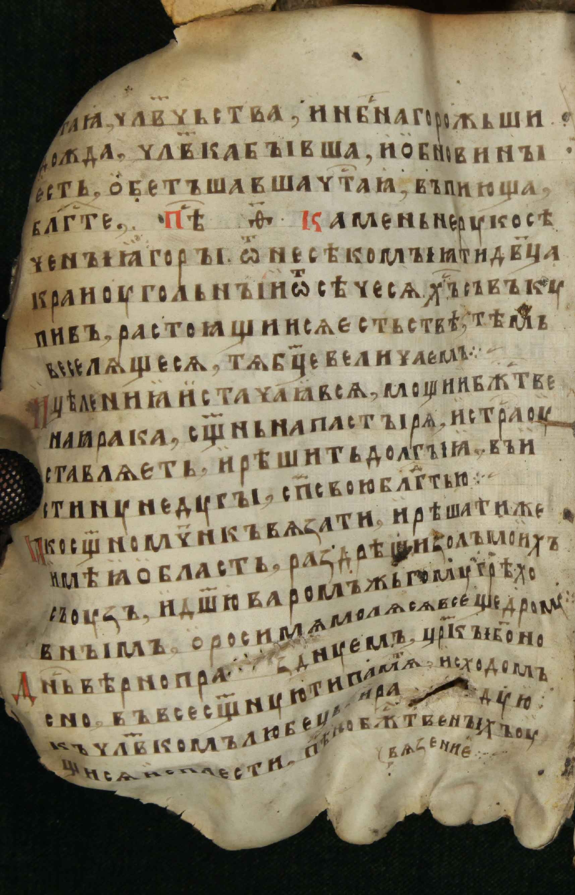
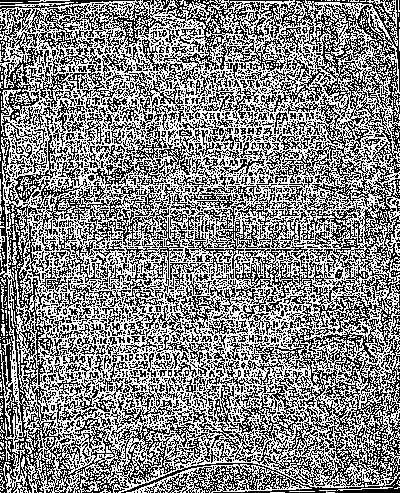

# Лабораторная работа №2
## Обесцвечивание и бинаризация растровых изображений

### Вариант 8: адаптивная бинаризация WAN
### Окно: 3x3

### Исходные данные
- Количество изображений: 3
- Метод: WAN (локальный порог по min/max)
- Размер окна: `3x3`
- Формат исходных изображений: PNG (`src/img*.png`)
- Формат полутоновых и бинарных изображений: BMP

### Формулы

Обесцвечивание (взвешенное усреднение RGB):

```text
I(x, y) = 0.299 * R(x, y) + 0.587 * G(x, y) + 0.114 * B(x, y)
```

Адаптивный порог WAN (локально по min/max):

```text
min(x, y) = min(I(i, j)), (i, j) in W(x, y)
max(x, y) = max(I(i, j)), (i, j) in W(x, y)
T(x, y)   = (min(x, y) + max(x, y)) / 2
B(x, y)   = 255, если I(x, y) > T(x, y), иначе 0
```

### 1. Приведение полноцветного изображения к полутоновому

#### 1.1 Изображение 1
Источник: `img0.png`

| Исходное (RGB, PNG) | Полутоновое (BMP) |
|:-------------------:|:-----------------:|
|  |  |

#### 1.2 Изображение 2
Источник: `img1.png`

| Исходное (RGB, PNG) | Полутоновое (BMP) |
|:-------------------:|:-----------------:|
|  |  |

#### 1.3 Изображение 3
Источник: `img2.png`

| Исходное (RGB, PNG) | Полутоновое (BMP) |
|:-------------------:|:-----------------:|
|  |  |

### 2. Бинаризация полутонового изображения методом WAN

#### 2.1 Изображение 1

| Полутоновое | WAN 3x3 |
|:-----------:|:-------:|
|  |  |

#### 2.2 Изображение 2

| Полутоновое | WAN 3x3 |
|:-----------:|:-------:|
|  |  |

#### 2.3 Изображение 3

| Полутоновое | WAN 3x3 |
|:-----------:|:-------:|
|  |  |

### Результаты выполнения

| Изображение | Размер | Бинарный файл |
|:------------|-------:|:--------------|
| №1 (img0.png) | 400x493 | `img0_binary_wan_w3.bmp` |
| №2 (img1.png) | 1715x2671 | `img1_binary_wan_w3.bmp` |
| №3 (img2.png) | 1794x2580 | `img2_binary_wan_w3.bmp` |

### Выводы

1. Реализовано обесцвечивание RGB-изображений без библиотечных функций grayscale.
2. Для варианта 8 реализована адаптивная бинаризация WAN с окном 3x3 без библиотечных функций бинаризации.
3. В отчете показаны результаты каждой операции (до и после) на нескольких изображениях.
